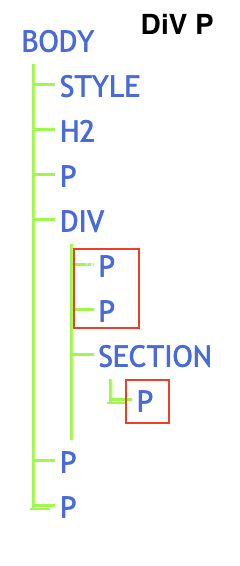
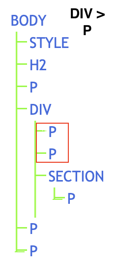
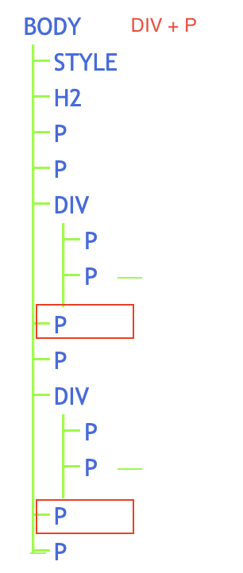

# CSS Simple Selectors
CSS selectors are used to "find" (or select) the HTML elements you want to style.

## (1) The CSS element Selector

The element selector selects HTML elements based on the element name.

`
p {
  text-align: center;
  color: red;
}`

`
body {
  margin: 0;
}`

`
  h1 {
    color: navy;
}`

_______

## (2) The CSS id Selector

The id selector uses the id attribute of an HTML element to select a specific element.

`
Hello World!
`

The id of an element is unique within a page, so the id selector is used to select one unique element!

`
#para1 {
  text-align: center;
  color: red;
}
`

To select an element with a specific id, write a hash (*#*) character, followed by the id of the element.

____

## (3) The CSS class Selector

The class selector selects HTML elements with a specific class attribute.

`<h1 class="center">Red and center-aligned heading</h1>`

`
Red and center-aligned paragraph.
`

To select elements with a specific class, write a period (.) character, followed by the class name.

`
.center {
  text-align: center;
  color: red;
}`

## (4) The CSS Universal Selector
The universal selector (*) selects all HTML elements on the page.

`* {
  text-align: center;
  color: blue;
}`

## (5) The CSS Grouping Selector

The grouping selector selects all the HTML elements with the same style definitions.

`h1 {
  text-align: center;
  color: red;
}`

`h2 {
  text-align: center;
  color: red;
}`

`p {
  text-align: center;
  color: red;
}`

Instead of repetitive statements, we can write this:

`h1, h2, p {
  text-align: center;
  color: red;
}`

## Activity 1

From simple-selectors.html file:
1. change the color of only the Heading 2.B tag
2. try to center all paragraph tags underneath the h2 tags and give them a green color. 
3. Change the margin of the body and padding to 0 pixel.

# Pseudo-classes

A pseudo-class is used to define a special state of an element.

It is a keyword added to a selector that specifies a special state of the selected element(s). 

For example, it can be used to:

1. Style an element when a user mouses over it
2. Style visited and unvisited links differently
3. Style an element when it gets focus

## Syntax

`selector:pseudo-class {
  property: value;
}`

## Activity 2

Open the `2.Pseudo-classes.html` file and try to use psuedo classes of `list` to change its appearance
1. Change the first list item to bold and brown in color.
2. Change the last item to italic.
3. Change the third element to blue in color.
4. Change the color of the first paragraph to red.
5. Change the `link`, `visited`, `hover` and `active` properties of anchor taga. 

**How can we style the specified parts of an element?** The answer is by using Pseudo-Elements.

# Pseudo-elements

A CSS pseudo-element is used to style specified parts of an element.

For example, it can be used to:

1. Style the first letter, or line, of an element
2. Insert content before, or after, the content of an element

`selector::pseudo-element {
  property: value;
}`

## Activity 3
1. Bold and capitalize the first line of a paragraph one from the file `Pseudo-elements.html` you are working on.
2. Make the first letter of each paragraph extra large using `font-size: xx-large;` and of red color.

# Other selectors (optional)

Head over to the following link and explore CSS Combinators
from w3schools website. 

https://www.w3schools.com/css/css_combinators.asp

1. Descendant Selector (space)

`div p {
  background-color: yellow;
}`
<!-- .png "Title") -->
  

2. Child Selector (>)

`div > p {
  background-color: yellow;
}`

<!--  -->
  

3. Adjacent Sibling Selector (+)

`div + p {
  background-color: yellow;
}`
<!--  -->
  

  

