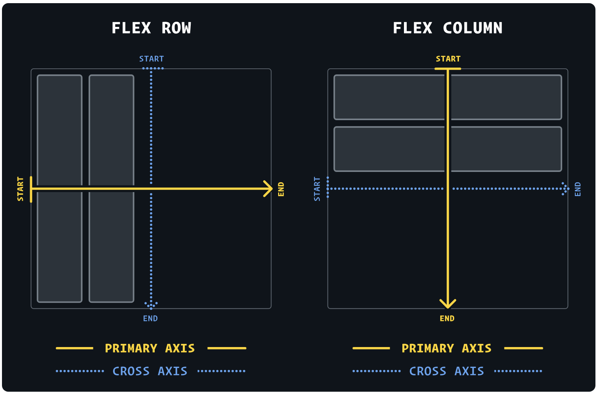

Note: Please download Flexbox poster here for a quick reference: https://css-tricks.com/snippets/css/a-guide-to-flexbox/

Also open this interactive tutorial while you are working on Flexbox: https://www.joshwcomeau.com/css/interactive-guide-to-flexbox/#bonus-unpacking-the-demo-16

## CSS Flexbox Layout Module

Before the Flexbox Layout module, there were four layout modes:

1. Block, for sections in a webpage
2. Inline, for text
3. Table, for two-dimensional table data
4. Positioned, for explicit position of an element

The Flexible Box Layout Module, makes it easier to design flexible responsive layout structure without using float or positioning.

## Activity 1
1. Open the `intro.html` file and observe its overall layout. 
2. Now try to add display property `display:flex` to the parent div. What did you notice? Change the display to the `display:block`

## The flex-direction Property

The `flex-direction` property defines in which direction the container wants to stack the flex items.

The `row` value stacks the flex items horizontally (from left to right):

The `column` value stacks the flex items vertically (from top to bottom):

## Activity 2
1. Open the `flex-direction.html` and add ` flex-direction: row;` to its parent div. 
2. Repeat the process by adding `flex-direction: column;`

## The flex-wrap Property
The flex-wrap property specifies whether the flex items should wrap or not.

## Activity 3
Try to add the following values to the parent div.
1. `flex-wrap: wrap;`  
2. `flex-wrap: nowrap;` 

## The flex-flow Property
The `flex-flow` property is a shorthand property for setting both the `flex-direction` and `flex-wrap` properties.

`.flex-container { display: flex; flex-flow: row wrap; }`

## The justify-content Property

The justify-content property is used to align the flex items.

## Activity 4

1. Open the file `4.justify-content.html` and use the ` justify-content: center;` in the parent container to align the flex items at the center of the container.
2. Try other values: `flex-start`, `flex-end`, `space-around`, and `space-between` and observe the behavior of the child containers. 
3. repeat the above steps by changing the `flex-direction: column;`

You can think of a `justify-content` as a skewer that holds together the meat pieces. You have to move other kebabs when you change the position of one kebab along the horizontal axis. Therefore, `justify-content` applies to the group of child containers. 

Source: https://www.joshwcomeau.com/css/interactive-guide-to-flexbox/#bonus-unpacking-the-demo-16

## The align-items Property

The align-items property is used to align the flex items.

## Activity 5 

Open the `5.align-items.html` and try to uncomment three lines (total of 8 sets) one by one and then see the behavior of the child containers. 

# CSS Flex Items (child elements)

The direct child elements of a flex container automatically becomes flexible (flex) items.

The flex item properties are:

1. order
2. flex-grow
3. flex-shrink
4. flex-basis
5. flex
6. align-self

Let's start with the `align-self`. Unlike `justify-content` and `align-items`, `align-self` is applied to the child element, not the container.

## Activity 6

1. Open the `6.align-self.html` and try to add `align-self: center`, `align-self: flex-start`, and `align-self: flex-end` to any of the child containers and observe the output. Keep the `flex-direction to row`
2. Repeat the activity with `flex-direction: column;`

## Growing and shrinking

1. The `flex-grow` property specifies how much a flex item will grow relative to the rest of the flex items.
2. The `flex-shrink` property specifies how much a flex item will shrink relative to the rest of the flex items.
3. The `flex-basis` property specifies the initial length of a flex item.

Note:  In a `Flex row`, flex-basis does the same thing as `width`. In a Flex column, `flex-basis` does the same thing as `height`.

Let's start learning by experimenting with `flex-basis`.

## Activity 7

1. Open the `7.Flex-grow.html` file. Set the `flex-direction:row`. Now add  ` flex-basis: 200px;` to the first child and see the output.
2.   Now set the `flex-direction:column` and add  ` flex-basis: 200px;` to any child container and see the output.

## flex-grow

1. By default, elements in a Flex context will shrink down to their minimum comfortable size along the primary axis. This often creates extra space. **The default value is 0 (which means elements are not allowed to grow)**

2. We can specify how that space should be consumed with the flex-grow property

## Activity 8

1. Open the `7.Flex-grow.html` file. Set the `flex-direction:row`. **Please notice the space on the right hand side of the container.** Now add  ` flex-grow: 1` to the first child and see the output. 
2. Try adding  ` flex-grow: 1` to the first child and ` flex-grow: 3` to the second. What did you see?
3.   Restore the orginal settings. Now set the `flex-direction:column` and add  ` flex-grow: 1` to any child container and see the output.
4.   Also, apply ` flex-grow: 1` to `.child` class and see the output. 

## flex-shrink

The flex-shrink property specifies how the item will shrink relative to the rest of the flexible items inside the same container. **The default value is 1, which means items are always shrinkable!**

## Activity 9
1. Open the `8.Flex-shrink.html` file, add `flex-shrink:1` to the first child, and add `flex-shrink:0` to the second child. Now decrease the size of the browser window and observe the output.
2. Try to add `flex-shrink:5` to the first child and `flex-shrink:1` to the second. What did you notice when you decreased the browser window?

