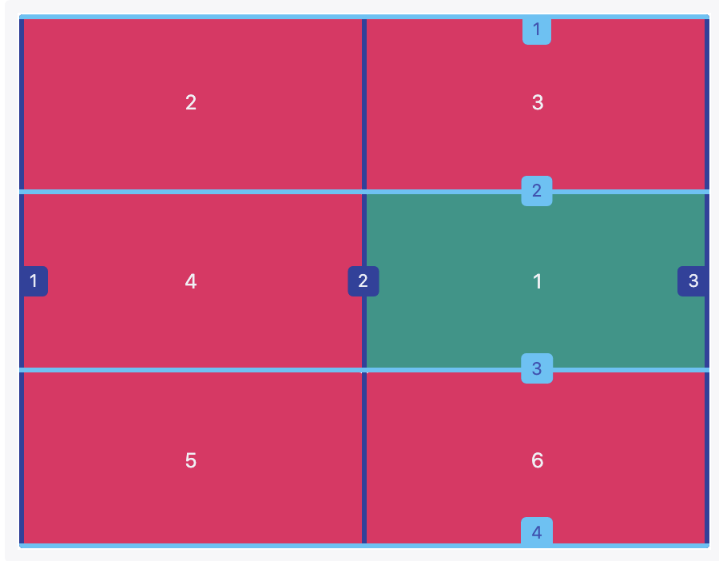

Note: Most of the text was adopted from [W3schools](https://www.w3schools.com/) and examples were adopted from codeacademy https://www.codecademy.com/. 

Very useful interactive introduction to CSS Grid can be found here: https://yoksel.github.io/grid-cheatsheet/

CSS Grid cheatsheet can be found here: https://grid.malven.co/

CSS Grid Garden is a great tool for honing your CSS grid skills. Give it a shot (later perhaps) and see how well you can do: https://cssgridgarden.com/" :)

# Grid Layout
The CSS Grid Layout Module offers a grid-based layout system, with rows and columns, making it easier to design web pages without having to use floats and positioning.

## Activity 1

1. Open the `1.intro.html` and in the ruleset for elements that have the class `grid`, set the display property to `grid`.
2. Inside the `.grid` ruleset, use the `grid-template-columns` property to create three columns. Set the first column to be 100px wide, the second to be 50% of the grid, and the third to be 200px wide.
3. Inside the .grid ruleset, use `grid-template-rows` to set the first row to be 40% of the grid’s height. Set the second row to be 50% of the grid’s height. And set the third row to be 50px.

## Grid Template
The shorthand property, grid-template, can replace the previous two CSS properties. Both grid-template-rows and grid-template-columns are nowhere to be found in the following code!

  `grid-template: 200px 300px / 20% 10% 70%;`

  The values before the slash will determine the size of each row. The values after the slash determine the size of each column. 

  ## Activity 2
  Refactor the grid template rows and columns code inside the .grid ruleset using the grid-template property. 

  ## Fraction

  CSS Grid introduced a new relative sizing unit — fr, like fraction.

  Using fr makes it easier to prevent grid items from overflowing the boundaries of the grid. Look at the following example:

   `grid-template: 2fr 1fr 1fr / 1fr 3fr 1fr;`

   The rows are splitting up the available 400 pixels of height into four parts. The first row gets two of those parts, the second row gets one, and the third row gets one. Therefore the first row is 200 pixels tall, and the second and third rows are 100 pixels tall.

   It is possible to use fr with other units as well. When this happens, each fr represents a fraction of the available space.

 ## Activity 3
 1. Change your rows so that each row will take up the exact same fraction of the available space. 
 
 2. Also, Change the grid so the middle column is still 50% of the grid, but the first column takes up three fourths of the remaining space and the last column takes up one fourth.

## Repeat
`.grid { display: grid;
  width: 300px;
  grid-template-columns: repeat(3, 100px);
}`

In the example above, using the repeat function will make the grid have three columns that are each 100 pixels wide.

[VERY IMPORTANT] The second parameter of repeat() can have multiple values.

`grid-template-columns: repeat(2, 20px 50px)`

This code will create four columns where the first and third columns will be 20 pixels wide and the second and fourth will be 50 pixels wide.

## Activity 4
Refactor the sizing of the rows to use the repeat() function.

## minmax

You can also create responsive columns and rows by defining the minmax function. Imagine that you want your middle column to shrink up to 100px if the screen is small, and for the larger screens, you want it to expand up to 500px. Look at the following example. 

`.grid {
  display: grid;
  grid-template-columns: 100px minmax(100px, 500px) 100px;
}`

## Activity 5
1. To see minmax() in action, we need to first make the grid have a variable width. `Delete the width declaration from .grid.`
2. Using minmax(), change the second column to be between 50 pixels and 300 pixels. Try resizing your browser window. What happens to the other columns when the second column reaches the 300 pixel limit?

## Grid Gap

 `gap: 20px 10px;`

 The first value will set the gap of 20px between rows, while the second value will set the gap of 10px between columns. 

 ## Activity 6
 Use the gap property to set the row gap to 20 and the column gap to 5px. 

 ## Grid Items

 In all of our examples, the items placed in the grid have always taken up exactly one square. This does not always need to be the case; we can drastically change the look of our grid by making grid items take up more than one row and one column. You can see this in the diagram to the right. Items A, B, C, and E span more than one row!

## Multiple Row Items and Columns

We can make single grid items take up multiple rows and columns.

For example;

`grid-row-start:    2;`  
`grid-row-end:      3;`  
`grid-column-start: 2;`  
`grid-column-end:   3;`  

Will select the green cell in the following figure. 

Instead of `grid-row-start` and `grid-row-end`, we can use the shorthand notation:  `grid-row: 4 / 6`, which means starts at row 4 and ends at 6. 

 ## Activity 7
1. Open the `2.Grid_items.html`. In the `a` ruleset, set `grid-row-start` so the item begins in the fifth and ends in the seventh row. 
2. Now open the Grid_items_2.html and position the element B so that it starts at row number 2, spans across three rows, and begins at column number 2 and spans across six columns.  
3. Finally, look at the example.html document where a finished web page was created using flexbox and CSS grid layout. The online version can be seen here: https://codepen.io/learnwebcode/pen/vYGExYx

Topics that we have not covered (becuase they are similar to what we have covered with flexbox) in this lesson are:

1. justify-items
2. justify-content
3. justify-self
4. align-items
5. align-content
6. align-self
7. grid-auto-rows
8. grid-auto-columns
9. grid-auto-flow

You are asked to cover at least the first six topics as part of a self-study. The next three are optional. 

