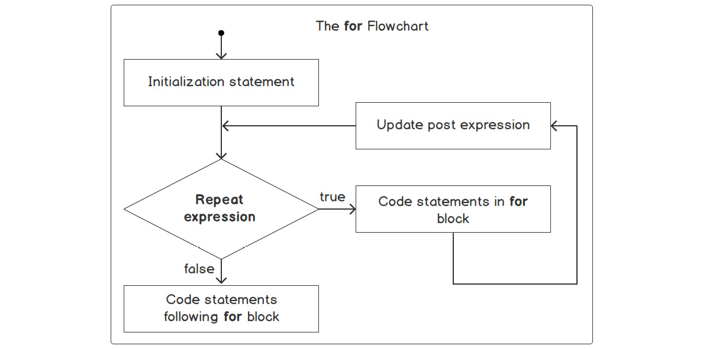
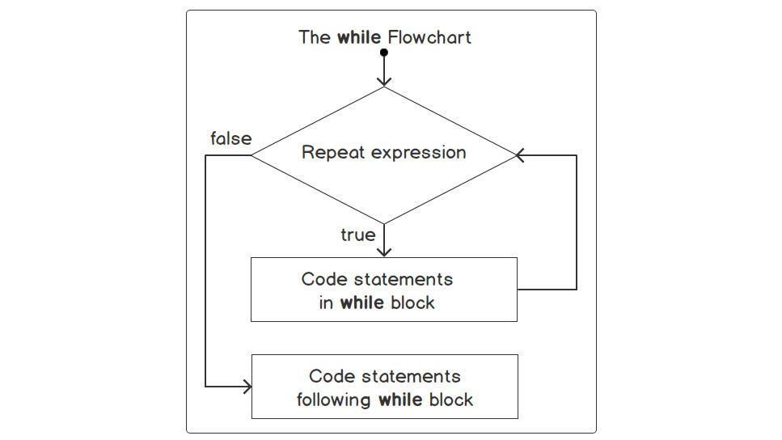
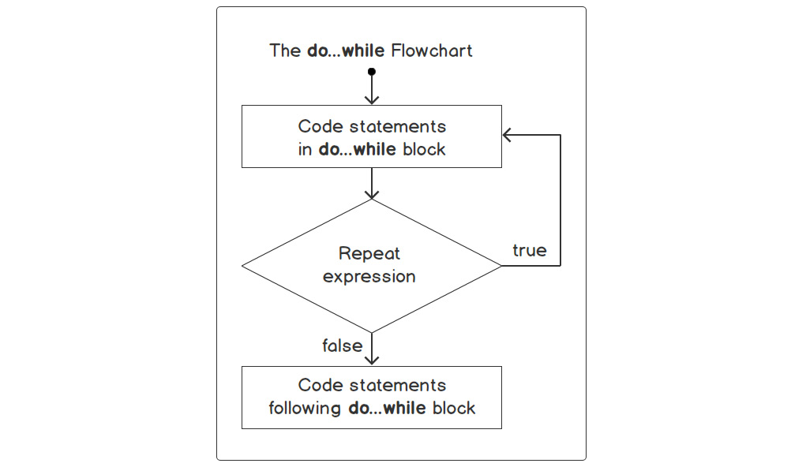

# For loop
For loop is used to repeat a statement or set of statements over a specific number of times. 

 
 

# While Loop
While Loop can execute a block of code as long as a specified condition is true.

 
 

# Do while
The do...while statements combo defines a code block to be executed once, and repeated as long as a condition is true.

The do...while is used when you want to run a code block at least one time.

# Debugging Code

1. Click on the Run and Debug option.
2. Click on the "create a launch.json" file.
3. Select "Web App (chrome)" in the drop-down menu that will appear.
4. VS code will add a new root folder with the name .vscode.
5. go inside this folder and change the configuration from "url": "http://localhost:8080", to "url": "http://localhost:3000" because your live server (Live preview) is running on this port.
6. Now click on the "port: 3000" on the bottom right corner of your VS code and select "show debug preview". 
7. you can then set the breakpoint by hovering over a line number in your JS code.
8. After setting the breakpoint, click the step over the button and observe the variable state in the variable window. 

# Debugging in Chrome
1. Open the `debug_example.html` file in chrome by copying its path.
2. Open the developer tools in your chrome browser.
3. Click on the sources, and under the page, you will find a script for the while loop.
4. Click anywhere on the line number, and it will place a breakpoint.
5. Now reload the HTML page; you will notice that the debugger is activated.
6. Now click the step-over button one at a time and observe the variables states in the scope window. 