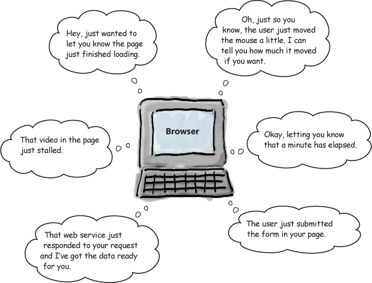

# Document Object Model

The HTML DOM is a standard for how to get, change, add, or delete HTML elements.


With the object model, JavaScript can:
1. Change all the HTML elements and their attributes
2. Change all the CSS styles
3. Remove existing HTML elements
4. React to all existing HTML events or create new ones.

## Getting Access to Elements in the DOM

```js
let userIdEle = getElementById("user-id");
```

```js
let divEles = getElementsByTagName("div");
```

```js
let noticeEles = getElementsByClassName("notice");
```

## Creating Elements and Content in the DOM

`createElement(tag name)`: Creates an HTMLElement object for the HTML tag name that's supplied.

<!-- ```js
let liEle = document.createElement("li");
``` -->

`createTextNode(data)`: Creates a text object that can be placed inside an HTML element, for example, inside an h1 or a p element. The data argument is a string.

<!-- ```js
let elementTextNode = document.createTextNode("Milk Moon");
``` -->
Suppose we want to append another li element to the Milk Moon. To do that, we use the document object's createElement method to create an li element:

```js
<ul>

 <li>Flower Moon</li>

 <li>Planting Moon</li>

</ul>
```


Steps:

1. We first need to create a new ```<li>``` element

```js
let liEle = document.createElement("li");
```
2. Then we create a new text node object.

```js
let text = document.createTextNode("Milk Moon");
```
3. Finally, we need to append this text node object to the `<li>`element above.
   
```js
liEle.appendChild(text);
```


## Other useful methods/properties of DOM

`innerHTML:` retrieves and sets the content of the tag as plain text.

`innerText`: retrieves and sets the content in HTML format.

`addEventListener(…)`: attaches an event handler to a document.

`appendChild(…)`: adds a node to a parent node

Let's see some nice examples!

## A note on event driven programming
`source: chapter 9: Head First JavaScript`
URL: https://www.bol.com/nl/nl/f/head-first-javascript-programming/9200000013994141/

The book is availbale in TU Library!

## Events
A lot is going on in the browser when the page is loaded; users clicking on the page, moving their mouse, and resizing the window are all called events.




The good thing is that you can write a function called event hander to catch these events and do some nice things :)

## Event handlers
Handlers are typically small pieces of code that know what to do when an event occurs. 

In terms of code, a handler is just a function. When an event occurs, its handler function is called.